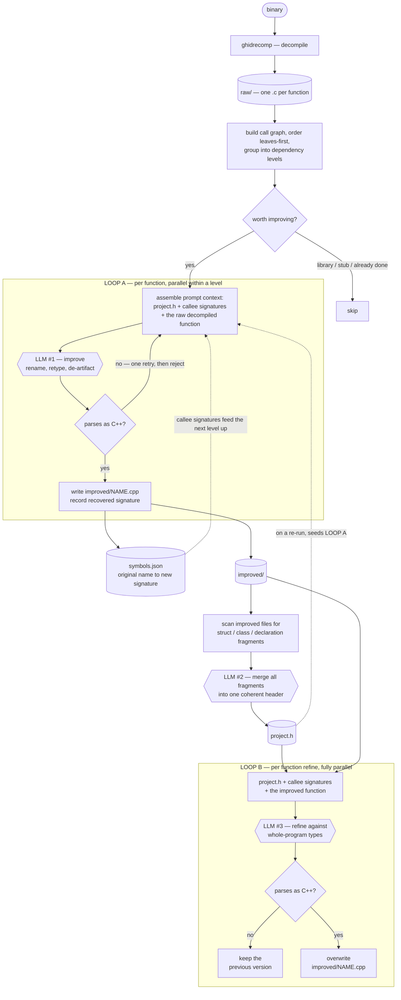

# AI Reverse Engineering Agent

WORK IN PROGRESS - FOR TESTING PURPOSES ONLY

A command-line tool that decompiles a C++ binary with Ghidra and uses an LLM to
push the result back toward readable source: real names, real types, and a
synthesized `project.h`.

## How it works



### Where the decompiled code meets the model

There are exactly **three** LLM boundaries, and they see different things:

**LLM #1 — the improve loop (per function).** This is where raw decompiler
output first reaches the model. Each function is sent on its own, never the
whole binary, wrapped in whatever context has been recovered so far: the
`project.h` from a previous run if one exists, plus the *already-improved*
signatures of the functions it calls. That ordering is the point of the call
graph — a caller is only sent after its callees, so by the time
`process_order` is improved, the model has already been told that
`FUN_00401820` is really `Order *find_order(Catalog *, int)`. Output must parse
as C++ or it gets one corrective retry, then is rejected and **not written**, so
a failure is retried on the next run rather than cached forever.

**LLM #2 — header synthesis (once).** Stage 1 leaves struct and class fragments
scattered across dozens of improved files, often partial and contradictory.
Every fragment is scanned out and sent in a single call to be merged into one
`project.h`.

**LLM #3 — the refine loop (per function).** Now that a whole-program view of
the types exists, every improved function is sent back with `project.h`
attached and rewritten against it. This is what turns `void *param_1` into
`Catalog *catalog` consistently across files. Output that doesn't parse leaves
the stage-1 version in place.

Note the order: `project.h` is built **before** the refine loop, from stage 1's
output — and the refine loop is what consumes it. Because it is written to the
workspace, a second `cpp-re` run also feeds it into LOOP A (the dashed edge),
so each run starts with better type context than the last.

### Stripped binaries

A shipped binary has no symbol table. Ghidra names everything `FUN_00401820`,
and the filter that normally keeps statically-linked libstdc++ out of the LLM
budget — which works by recognising names like `std::vector<...>::size` — goes
completely blind. Measured on the `tier4_taskflow` corpus binary, the same
program stripped versus unstripped:

| | unstripped | stripped |
|---|---|---|
| functions decompiled | 496 | 731 |
| carry a demangled name | 405 | **0** |
| detected as library code | 390 | **55** |
| **would be sent to the LLM** | **67** | **518** |

So ~450 of those calls would be spent improving `std::vector::_M_realloc_insert`.
Worse, leaves-first ordering means the *deepest* functions go first — exactly
the library leaves — so `--limit 40` on a stripped binary would spend the entire
budget without reaching the program's own code.

What still works without symbols is the **shape of the call graph**. The entry
point is identifiable without any symbol (nothing calls it, and it reaches most
of the program), and the user's code sits near it while the linked-in library
piles up deeper. So on a stripped binary `cpp-re` keeps only functions within
`--max-depth` calls of the entry (default 2):

| `--max-depth` | functions sent | precision | recall | f1 |
|---|---|---|---|---|
| off | 518 | 11.4% | 89.4% | 20.2% |
| 1 | 29 | 72.4% | 31.8% | 44.2% |
| **2 (default when stripped)** | **72** | **55.6%** | 60.6% | **58.0%** |
| 3 | 132 | 35.6% | 71.2% | 47.5% |
| 4 | 210 | 23.3% | 74.2% | 35.5% |

86% fewer calls at 5× the precision, for ~29 points of recall. These are
measured, not estimated — `python -m eval.stripped --case tier4_taskflow`
reproduces them, scoring the pipeline's real selection against ground truth
built from the fact that stripping doesn't move code (see
[eval/README.md](eval/README.md)). Raise `--max-depth` to trade the other way,
or `--max-depth 0` to disable it. The
filter is applied only when the binary looks stripped, and is skipped entirely
when the call graph is too sparse for depth to mean anything (heavy indirect or
virtual dispatch), since dropping work is worse than a wider budget.

Address-band and libstdc++-idiom heuristics were both tried and measured
first — each moved precision by about one point, and were rejected.

### Shared objects

A `.so` is a different and much easier case, because `strip` **cannot** remove
its dynamic symbol table — the loader needs it. The same `tier4_taskflow`
sources built as a stripped shared library:

| | stripped executable | stripped `.so` |
|---|---|---|
| functions | 731 | 861 |
| `FUN_`-named | 643 (88%) | **5 (0.6%)** |
| detected as stripped | yes | **no** |

The public API keeps its names, so the ordinary name-based filter works and no
depth filter is applied. Of the library's 37 exported functions, **30 are
improved**; the 7 skipped are `count`/`size`/`metrics` (one-line accessors the
gate correctly rejects) and `describe`/`format_summary`/`join_names`/`report`,
which return `std::string` and are the ones lost to the Windows alternate-data-
stream bug described above.

A shared object has no single entry point, so depth (when it is needed) is
measured from **every exported function** as a multi-source BFS, not from one
root. Using a single root would treat most of a library's own API as
unreachable, i.e. as deep library noise, and skip exactly the functions a
caller of the library cares about.

### Naming what has no name

The improve pass usually declines to rename `FUN_00401820` — with a single
function body in view there is often nothing to name it *after*. On the
stripped tier4 binary, **55 of 72** improved functions still carried a
synthetic name at the end of stage 2, and 414 call sites still read `FUN_...`.

So a final pass runs when anything is still unnamed. It has the context the
improve pass lacked: `project.h`, every improved body, and a call graph over
recovered code. It goes leaves-first, because a caller is far easier to name
once you can see it calls `reset_metrics` and `find_task_by_id` rather than two
hex addresses — on the real workspace, half the proposals had at least one
already-named callee in view.

A name is only useful if it is applied everywhere, so each rename rewrites the
definition, **every call site across every file**, and the file itself —
`FUN_0010ca7a-0010ca7a.cpp` becomes `search_container.cpp`. Files are aligned
even when nothing new is named, which catches the ones stage 1 renamed
internally while their filename kept the placeholder.

Renaming files would ordinarily break resume, since stage 1 checks whether
`improved/<raw name>.cpp` exists — it would improve the function again and
write a second copy. `names.json` records the file mapping and the resume check
follows it. Proposals are checked
against C++ keywords and every identifier already in use, and a collision is
numbered rather than duplicated (two functions sharing a name would not
compile). The mapping is written to `names.json` so any name traces back to its
address.

```bash
cpp-re app.bin --no-naming             # skip it
cpp-re app.bin --stages name           # only this pass, over an existing workspace
```

On the tier4 stripped workspace this removed 52% of the remaining `FUN_`
references. The rest are calls to functions that were never improved — filtered
out as library code, so there is no body to name them from. Naming cannot
recover what the pipeline never looked at.

### Loop shapes

**LOOP A is parallel within a level, sequential across levels.** Functions in
one dependency level cannot call each other, so they are improved concurrently
(`--workers`); the next level starts only after every signature from the
previous one is recorded. That is why parallelism is per-level rather than a
flat thread pool — a flat pool would improve callers before their callees and
lose the signature propagation entirely.

**LOOP B is fully parallel — no levels at all.** `project.h` and the stage-1
signature map are both fixed before the pass starts, and no refinement feeds
another, so there is nothing for one call to wait on. It runs `--workers` wide
over every improved function at once, which scales better than stage 1 because
there are no level boundaries to join at:

| `--workers` | 1 | 2 | 4 | 8 |
|---|---|---|---|---|
| speedup | 1.0× | 2.0× | 4.0× | 7.9× |

The single header-synthesis call between the two loops is the one genuinely
serial step, and the reason a very large binary will eventually need that
prompt chunked.

Runs are **resumable**. Output already written is skipped, and a failed function
is never written, so re-running retries exactly what failed.

## Prerequisites

1. **Ghidra** — installed, with `GHIDRA_INSTALL_DIR` set.
2. **Python 3.10+**
3. **An LLM** — either a Google API key, or a local OpenAI-compatible server
   (LM Studio, Ollama, llama.cpp, ...).

## Installation

```bash
pip install -e ".[dev]"
```

Configure via `.env` (or the environment):

```
GHIDRA_INSTALL_DIR=C:\Path\To\Ghidra
GEMINI_API_KEY=your_key_here
LOCAL_LLM_URL=http://localhost:1234/v1
```

## Usage

```bash
cpp-re path/to/binary                      # both stages
cpp-re path/to/binary --dry-run            # plan only: no LLM calls, no cost
cpp-re path/to/binary --stages improve     # stage 1 only
cpp-re path/to/binary --provider gemini --workers 8
cpp-re path/to/binary --limit 10 --json summary.json
```

`cpp-re --help` lists everything. Also runnable as `python -m cpp_re_agent`.

Start with `--dry-run`: it decompiles (cached afterward) and reports how many
functions would be improved, the call-graph shape, and how many sequential LLM
rounds that costs at your `--workers` setting — before spending anything.

| flag | what it does |
|---|---|
| `--stages all\|header\|improve` | how far to run |
| `--limit N` | improve at most N *real* functions (library/stub code is filtered out before counting) |
| `--workers N` | concurrent LLM calls per call-graph level. Use `1` for a local endpoint that serves requests serially |
| `--provider local\|gemini` | which LLM to use; `--model` overrides the per-provider default |
| `--output-dir DIR` | workspace location (default `./workspace/<binary>`) |
| `--json FILE` | write the run summary as JSON |
| `--dry-run`, `-q` | plan without calling an LLM; quiet output |

Output lands in `workspace/<binary>/`:

```
raw/          ghidrecomp's decompilation
improved/     one .cpp per improved function
project.h     synthesized types
symbols.json  original name -> recovered signature
runs.json     provenance: which model produced this
```

## Measuring changes

`eval/` scores output against known-good originals so prompt/model changes can
be judged by a number rather than by eye. See [eval/README.md](eval/README.md).

```bash
python -m eval.run_eval --candidates workspace          # score what you just ran
pytest                                                  # unit + similarity tests
```

## Project structure

* `src/cpp_re_agent/` — the package
  * `cli.py` — the command-line entry point
  * `pipeline.py` — stage orchestration (batch improve, synthesis, refine)
  * `decompiler.py` — `ghidrecomp` wrapper
  * `ai_improver.py` / `contextual_improver.py` — the two LLM passes
  * `callgraph.py` / `symbol_map.py` — ordering and signature propagation
  * `scanner.py` — Tree-sitter parsing, function identity and name resolution
  * `knowledge_graph.py` — type merging into `project.h`
* `eval/` — measurement harness and corpus
* `tests/` — pytest suite
* `examples/` — sample sources/binaries
* `workspace/` — pipeline output
